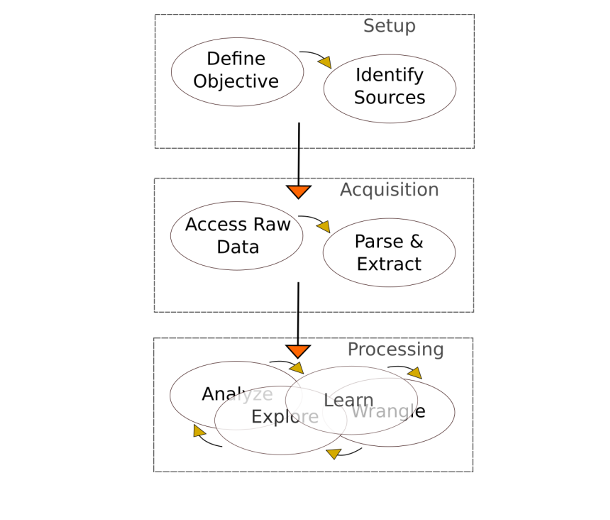

# 
 A Datum Walked into a Bookstore:

 Web Scraping, Data Collecting, and More 

      
                                    Painted by Justin Wadge (Wadge, 2015)

## Contents:
- [Introduction](#Introduction)
- [Setup Phase](#Setup-Phase)
- [Acquisition Phase](#Acquisition-Phase)
- [Processing Phase](#Processing-Phase)
- [Conclusion](#Conclusion)
- [References](#References:)
- [Kaggle Links](#Kaggle-Links:)

# Introduction

 In this project, the web scraping pipeline framework is employed to organize the working process (see Image 1). The framework is carried out in three phases: setup, acquisition, and processing. In the setup phase, an objective is defined, which is to predict bestselling books with maximum accuracy and minimal time. The Waterstones website will be used for this task. In the acquisition phase, data will be scraped from the Waterstones website, then parsed and extracted using the web scraping tools Beautiful Soup and Selenium. The purpose is to change the data into a usable format. In the processing phase, data will be processed in two main stages: data understating and data preparation.

           
                 Image 1: Scraping Pipeline Framework (source: edited image from Laetsch, 2020)
                 
# Setup Phase
## Problem Statement
### 
<strong><em> Bestseller or not bestseller — that is the question. </strong>

 Every day, vast amounts of data are generated and used, which many industries rely and capitalize on, such as the entertainment, sports, and IT industries. The publishing industry uses data to predict bestsellers, which is not a simple process. Conventionally, predicting bestsellers is done mostly by sharp critics and publishing houses after an extremely long process that is a mix of intuition and informed guesses. Although this process once served the industry well, it is both lengthy and costly, and the predictions are not always accurate. The objective of collecting this data is to predict bestselling books with maximum accuracy based on the provided datasets.

# Acquisition Phase
## Web Scraping
### 
<strong><em> Where the magic happens. </strong>

 In this phase, data will be extracted from Waterstones’s online bookstore and transformed into structured data for further analysis. This website was chosen for its high volume of sales and thus provides a lot of insights.

## Preprocessing
In this section, raw data is being processed for other processing procedures.

# Processing Phase
## Data Understanding
### 
<strong><em> To err is machine, to clean is divine.</strong>

 In this phase, there are three main stages: data understating, where the data will be examined for its quality, quantity, and usefulness, among other things; data preparation, which is concerned with cleaning and preparing data for analysis; and data analysis, when data will be analyzed and visualized.

## Dataset Description
The books dataset contains information about the listed books.

### Variable Description
- **book_name**: refers to the name of the book
- **author**: refers to the name of the author
- **availability_status**: refers to the status of the book: in stock, in stock online, available in 1 week, pre-order, cancelled, or click and collect only
- **original_price**: refers to the price of the book
- **current_price**: refers to the current price of the book
- **star_rating**: refers to customer submitted reviews
- **book_status**: refers to the book’s selling status: either a bestseller or not

## Data Visualization

#### Profile Report:
The following code is used to generate a report for each feature displaying the following: type inference, quantile statistics, descriptive statistics, deviation, most frequent values, histogram, correlations, missing values matrix, and more.

## Data Preparation
In this section, the data is being split into train and test datasets to prepare it for Kaggle submission.

### Spliting the data 

# Conclusion

 Web scraping is a crucial skill to acquire in today’s data driven world. Collecting large datasets is fundamental to big data analytics, artificial intelligence, and machine learning. With the explosion of online information, data is becoming much easier to access than ever before using web scraping tools and skills. 

## References:

- 
 Laetsch, T., 2020. Web Scraping With Python, accessed on 19 Mar, 2020:(https://campus.datacamp.com/courses/web-scraping-with-python/introduction-to-html?ex=1).

- 
 Wadge, J., 2015. Eidlitz: Baroque Libraries, accessed on 19 Mar, 2020:(https://www.justinwadge.com/Architecture/Eidlitz-Baroque-Libraries).

## Kaggle Links:

- <a href="https://www.kaggle.com/maramedrees/a-datum-walked-into-a-bookstore" target="_blank">Dataset</a>
- <a href="https://www.kaggle.com/maramedrees/a-datum-walked-into-a-bookstore-starter-code?scriptVersionId=30473876" target="_blank">Kernal</a>
